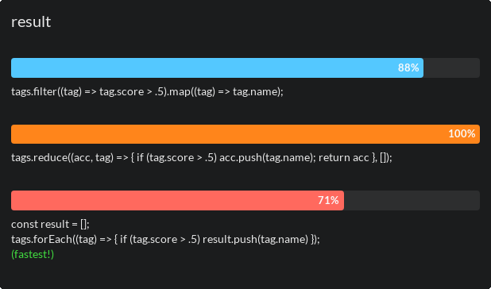

= How to use the Array.reduce method to combine the map and filter operations
:author: Sylvain Leroux
:pin: 677088125201762049
:revnumber: 1.1
:revdate: 2018-03-28T00:20:41+02:00
:keywords: JavaScript, Array, Map, Filter, Reduce

[.teaser]
Maybe did you already know how to use the `filter` and `map` array methods in JavaScript? But how to perform those operations both at the same time? `Array.reduce` is the solution...

== Our example
For the purpose of that article, I will assume I have the following array of objects:

[.runkit#preamble]
----
const tags = [
  { name: "Linux", score: .6 },
  { name: "Open Source", score: .7 },
  { name: "Bash", score: .9 },
  { name: "Shell", score: .8 },
  { name: "Awk", score: .2 },
  { name: "Sed", score: .3 },
];
----

It represents a small collection of tags, with their name and some relevance score. We will see how we can process that array to extract the name of the most relevant tags.

image::tag.jpg[A simply illustrative price tag]

==  Extracting a subset of an array with `Array.filter`
In our example, I want to keep only the most relevant tags. We will assume a "relevant" tag has a score strictly greater than 0.5.

This requirement can easily be expressed in javascript:

----
(tag) => tag.score > .5
// or if you don't like fat arrow functions:
// function(tag) { return tag.score > .5 }
----

That function will return either _true_ or _false_ depending on the score of the tag received as a parameter.

This function is all that is required by the https://developer.mozilla.org/en-US/docs/Web/JavaScript/Reference/Global_Objects/Array/filter[`Array.filter`] method to work: once given a filtering function, `Array.filter` will apply it to every element of the original array, and will produce a new one containing only the elements having succeeded at the test (i.e., for whose the filtering function has returned _true_):

[.runkit,preamble=preamble]
----
tags.filter((tag) => tag.score > .5);
//- [ { name: 'Linux', score: 0.6 },
//-   { name: 'Open Source', score: 0.7 },
//-   { name: 'Bash', score: 0.9 },
//-   { name: 'Shell', score: 0.8 } ]
----

Now we have the most relevant tags according to our requirements. But I only want their name. That is a job for the `Array.map` function.

==  Mapping item values to a new array using `Array.map`
In my example, a tag is an object. However, I am only interested in the `name` field of that object, not by the entire object.

Once again it is quite easy to write a function to extract the name of a tag:

----
(tag) => tag.name
// or if you don't like fat arrow functions:
// function(tag) { return tag.name }
----

If you give such function to the https://developer.mozilla.org/en-US/docs/Web/JavaScript/Reference/Global_Objects/Array/map[`Array.map`] method, it will return a new array whose elements are obtained by applying the user function to the corresponding elements of the initial array:

[.runkit,preamble=preamble]
----
tags.map((tag) => tag.name);
//- [ 'Linux', 'Open Source', 'Bash', 'Shell', 'Awk', 'Sed' ]
----

Remember, I wanted only the name of the most relevant tags. However, since both `Array.map` and `Array.filter` applies to an array, and return a new array, you can chain them:

[.runkit,preamble=preamble]
----
tags.filter((tag) => tag.score > .5)
    .map((tag) => tag.name);
//- [ 'Linux', 'Open Source', 'Bash', 'Shell' ]
----

You may argue such solution _could_ be inefficient because the overhead cost incurred by the function calls. So, can't we find a solution to combine both the `Array.map` and `Array.filter` in only one operation? Indeed, we can do that using the `Array.reduce` method.

== Introducing `Array.reduce`
To quote the Mozilla MDN web documentation:

____
The reduce() method applies a function against an accumulator and each element in the array (from left to right) to reduce it to a single value.
____

It is not immediately obvious how this relates to my initial problem. However, if you consider in that definition the _accumulator_ is the result array, you may understand the https://developer.mozilla.org/en-US/docs/Web/JavaScript/Reference/Global_Objects/Array/reduce[`Array.reduce`] method as something with a semantic very close to the one of `Array.map` or `Array, filter`. The difference is, with `Array.reduce`, the result array is _explicitly_ passed as an argument and maintained by the user function instead of being _implicitly_ handled by the JavaScript provided method.

Maybe an example would make things more clear. Do you remember the filtering code we used earlier?

----
tags.filter((tag) => tag.score > .5);
//- [ { name: 'Linux', score: 0.6 },
//-   { name: 'Open Source', score: 0.7 },
//-   { name: 'Bash', score: 0.9 },
//-   { name: 'Shell', score: 0.8 } ]
----

That code can be rewritten using `Array.reduce` instead to produce _exactly_ the same result:

[.runkit,preamble=preamble]
----
tags.reduce((acc, tag) => { if (tag.score > .5) acc.push(tag); return acc }, []);
//- [ { name: 'Linux', score: 0.6 },
//-   { name: 'Open Source', score: 0.7 },
//-   { name: 'Bash', score: 0.9 },
//-   { name: 'Shell', score: 0.8 } ]
----
There are several things to notice here:

* First, the user method now takes two arguments since the accumulator is explicitly passed in addition to the current item at each call.
* Then, we must also explicitly handle that accumulator by pushing the items we want to keep. Something that was handled for us under the hood by `Array.filter` and `Array.map`.
* For the same reason, the user function has to explicitly return the accumulator after each iteration.
* Finally, we have to pass the initial value of the accumulator--an empty array--as the last argument of `Array.reduce`.

To test your understanding, you may stop reading here and try to implement `Array.map` using the `Array.reduce` method.

image::filtering-data[Screening of sand and clay in an Indian village]

== Combining `filter` and `map` using a single `reduce` call
If you've done the little exercise I suggested above, you should now have gained confidence in using the `Array.reduce` method. So, I will directly jump to rewriting our previous _filter+map_ solution as just one `Array.reduce` operation. Of course, you remember the code we used:

----
tags.filter((tag) => tag.score > .5).map((tag) => tag.name);
----

Ok, this is your last chance to try it by yourself. Are you ready for the solution? So, here it is:

[.runkit,preamble=preamble]
----
tags.reduce((acc, tag) => { if (tag.score > .5) acc.push(tag.name); return acc }, []);
//- [ 'Linux', 'Open Source', 'Bash', 'Shell' ]
----

While interesting and quite readable, I must admit my deception when I realized after having run a benchmark (on my Chrome browser) that latest solution was consistently the slowest than the previous one. Of course, depending on your platform and your particular use case, the results may vary. Nevertheless, I wondered in there was some more efficient way of doing.

== An alternate solution
In JavaScript, nested function can access variables defined in the outer scope. So maybe that could perform better:

[.runkit,preamble=preamble]
----
const result = [];
tags.forEach((tag) => { if (tag.score > .5) result.push(tag.name) });
console.log(result)
//- [ 'Linux', 'Open Source', 'Bash', 'Shell' ]
----

And indeed, that latest option was consistently the fastest of the three I suggested in this article. Once again, this is just the result of running http://jsben.ch/SxhNl[a benchmark] in the particular conditions of my browser and using a very small dataset. I encourage you to do your own tests corresponding to your particular use case if you really need the best performances here.

Speaking of that, a plain old _for loop_ will undoubtedly perform even better. But as of myself, I find the functional style more readable, and, unless when working on the critical loop of an application, I would favor the readability and maintainability of a piece of code rather than its (more or less) supposed efficiency. Of course, that is a matter of taste, so feel free to disagree here!

Anyway, I hope this article helped you to better understand the `Array.map`, `Array.filter` and `Array.reduce` methods and how you can combine them to process your data.

If you enjoyed that reading, don't hesitate to share this article on your favorite social network. You will find a couple of buttons on the top of the page just for that purpose! Finally, as always, let me know on https://yesik.it/twitter[Twitter] or https://yesik.it/facebook[Facebook] if you want more articles like this one!
