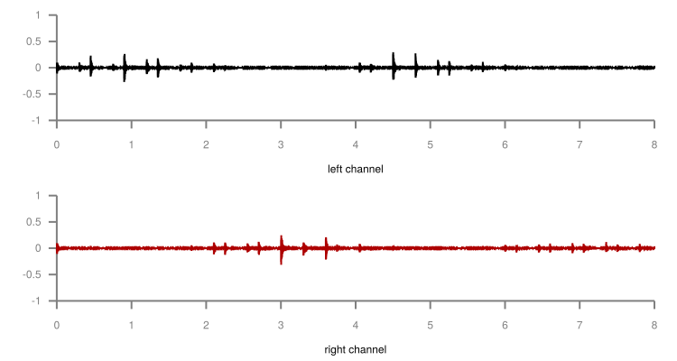

= How to process audio files from the command line with SoX
:author: Sylvain Leroux
:pin: 677088125201762093
:revnumber: 1.0
:revdate: 2018-04-11T11:19:53+02:00
:keywords: SoX, Sound, Linux, CLI

[.teaser]
If you follow me regularly, you know I am a command-line aficionado. However, I must admit for most my audio/video editing I use GUI applications. For _most_ of it. But even for that purpose, there are excellent command line tools that can improve your efficiency, especially when it comes to repetitive tasks or batch processing.+
Today, I will show you some of my favorite tricks using http://sox.sourceforge.net/[SoX], the "Swiss Army knife of audio manipulation."

== Acknowledgments
Describing sound manipulation without the material available at hand is not very fun. So if you want to practice with SoX by yourself, all the original _.wav_ files used in this article are available to download free of charges on https://www.noiiz.com/[Noiiz.com]. Thanks to Dave Rose and the whole Noiiz team for their great work in making quality sound accessible to a broad range of creators.

image::piano-socks.jpg[Illustrative image showing black men socks arranged on a heater like a piano keyboard]

== Basic example
Before going into the heart of the topic, let's introduce the basic SoX syntax:

----
sh$ sox inputfile outputfile [filter ...]
----

It takes an input file, processes it through zero, one or several filters, then write the result to the output file.  Input and output files can be encoded in any SoX supported audio format. You can specify the exact encoding on the command line, but most of the time this is not required since SoX will guess it based on the filename extension.

Without any filter, SoX copy the input file to the output file--so this may be useful if you have to re-encode some sound to a different format:

----
sh$ sox 100_D_LikeAClock_02_381.wav \
        100_D_LikeAClock_02_381.aiff
----

As it is often the case with similar tools, SoX uses a lossless intermediate representation of your sound during the processing. That means if you use a lossy format for both the input and the output, it will first decode your sound and then re-encode it, with a possible loss of quality. Even if both formats are the same:

----
# Lossless to lossy: some loss is expected
# Probably unhearable since this is the first
# lossy encoding generation:
sox 125_E_Adlib_04_371_SP.wav lossy.vorbis
play lossy.vorbis
----

----
# At the 10th generation, audio artifacts and
# global degradation are perfectly audible:
for i in {02..10}; do
    sox lossy.vorbis lossy-${i}.vorbis
    cp lossy-${i}.vorbis lossy.vorbis
done
play lossy-10.vorbis
----

== Special filenames
Even if this is not its primary purpose, SoX can _play_ and _record_ sounds too. In the simplest use case, this is achieved by using some options instead of the input (respectively output) filename:

[cols=".<3,^.<1,^.<1,.<3"]
|===
a|
----
-d
----
| |[.small-caps]#Out#|The default sound output device
a|
----
-r
----
|[.small-caps]#In#| |The default sound input device
a|
----
-n
----
|[.small-caps]#In#|[.small-caps]#Out#|The "null" device. For input, it produces an infinite stream of silence, and for output, it will just discard the samples.
a|
----
-t alsa <ALSADEVICE>
----
|[.small-caps]#In#|[.small-caps]#Out#|Use the given alsa device instead of a file.
|===

For convenience, the SoX package also provides the `play` and `rec` tools. So, to play a sound you can use either:

----
sh$ sox 100_D_LikeAClock_02_381.wav -d
# or
sh$ sox 100_D_LikeAClock_02_381.wav -t alsa default
# or
sh$ play 100_D_LikeAClock_02_381.wav
----

It is not difficult to deduce from that the command you can use to record sound with SoX. So, I let that for you as an exercise. But as a hint, I would suggest taking a look at the https://linux.die.net/man/1/sox[sox(1)] manpage...

== Obtaining information about a file
Before looking at SoX filter options to transform a sound, we may take a look at the pseudo-transformation `stat`, allowing to obtain information _about_ a sound file:

----
sh$ sox 100_D_LikeAClock_02_381.wav -n stat
Samples read:           1693440
Length (seconds):     19.200000
Scaled by:         2147483647.0
Maximum amplitude:     0.344360
Minimum amplitude:    -0.315002
Midline amplitude:     0.014679
Mean    norm:          0.007990
Mean    amplitude:    -0.000015
RMS     amplitude:     0.016408
Maximum delta:         0.398468
Minimum delta:         0.000000
Mean    delta:         0.005510
RMS     delta:         0.013702
Rough   frequency:         5860
Volume adjustment:        2.904
----

You may notice here the use of the -n option instead of the output file because we are not interested in the result of the transformation chain, but only by the file statistics.

SoX also provides the `soxi` command. But this one only displays the information found in the file's _header_. So you may sometimes see differences between that and the result of `sox ... stat`, which is based on the file's _content_:

----
sh$ soxi 100_D_LikeAClock_02_381.wav

Input File     : '100_D_LikeAClock_02_381.wav'
Channels       : 2
Sample Rate    : 44100
Precision      : 16-bit
Duration       : 00:00:19.20 = 846720 samples = 1440 CDDA sectors
File Size      : 3.39M
Bit Rate       : 1.41M
Sample Encoding: 16-bit Signed Integer PCM
----

Worth mention this is a true stereo sound--even if this would not be obvious if you listen to it. However, we can confirm that by plotting the difference between the channels.

== Padding a sound with silence
Why would someone want to add some silence at the end of a sound file? Well, I had that exact need this week: I downloaded a couple of sound effects (SFX) to enrich my video's audio tracks, some of them being pretty short "pops" or "cracks." On that occasion, I discovered my video editor was unable to process sound files whose length was shorter than one frame (1/25th of second in my case).

The solution? Pad the sounds with some silence, so they reach the minimum length for my video editor to accept them. Let's examine first the actual length of the problematic SFX file:

----
sh$ sox ClosePopFoley_02_562.wav -n stat 2>&1 |
    grep Length
Length (seconds):      0.013923
----

Simple math shows that to reach a duration of 1/25th of a second, we need to pad that sound with about 0.027s of silence:

----
sh$ sox ClosePopFoley_02_562.wav \
        ClosePopFoley_02_562.pad.wav \
        pad 0 .027
sh$ sox ClosePopFoley_02_562.pad.wav -n stat 2>&1 |
    grep Length
Length (seconds):      0.040930
----

You may have noticed that pad command takes two arguments. The first one is the amount of silence to add at the _start_ of the sound stream. The second one the amount of silence to add at the _end_ of the stream. Since I only want to add silence at the end of my file, I set the start pad length to 0. In fact, the pad command can add silence at an arbitrary position in the file. But I let you check the https://linux.die.net/man/1/sox[SoX manual] by yourself to see the actual syntax.

== Mix-down a stereo track to mono
The SFX tracks above are https://en.wikipedia.org/wiki/Stereophonic_sound[stereo] (two channels). For some special treatments, I will describe later, I may need to mix them down to https://en.wikipedia.org/wiki/Monaural[mono] (one channel). Something quite easy using the `remix` effect:

----
sh$ sox 100_D_LikeAClock_02_381.wav \
        mono.wav \
        remix 1,2
sh$ soxi mono.wav

Input File     : 'mono.wav'
Channels       : 1
Sample Rate    : 44100
Precision      : 16-bit
Duration       : 00:00:19.20 = 846720 samples = 1440 CDDA sectors
File Size      : 1.69M
Bit Rate       : 706k
Sample Encoding: 16-bit Signed Integer PCM
----

The `remix` effect takes a list of channel mapping as the argument. Here "1,2" means the average of channels 1 and 2. Since there is only one channel specification as the argument to the remix command, the output is single-channel (mono).

You may also want to use the pseudo-channel 0 to create a silence output channel:

----
# Mix down a stereo track to mono in the left output channel,
# with silence in the right channel:
sh$ sox 100_D_LikeAClock_02_381.wav \
        -d \
        remix 1,2 0
# Same thing but with silence on the left output channel
sh$ sox 100_D_LikeAClock_02_381.wav \
        -d \
        remix 0 1,2
----

Finally using a similar solution, you can create a https://support.google.com/moviestvpartners/answer/7454328?hl=en[dual mono track]:
----
sh$ sox 100_D_LikeAClock_02_381.wav \
        dual-mono.wav \
        remix 1,2 1,2
----

Something I could have written like that instead (but at the expense of creating the mono file first):
----
sh$ sox mono.wav dual-mono.wav remix 1 1
----

I encourage you to compare the result obtained by plotting the dual-mono file with the plotting of the stereo file we have seen earlier to be sure to understand the difference:

== Combining several audio files
Until now we used only one input file. But the `sox` command allows you to load several of them. In that case, you may need to specify how SoX should combine them. The most useful combiners are the `concatenate` (`--combine concatenate`) and the `merge` (`--combiner merge`) combiners.

=== Concatenate audio files
As it's name implies the _concatenate_ combiner, which is also the SoX default combiner, take several input files and concatenate them to the output:

----
sh$ sox --combine concatenate \
        100_D_LikeAClock_*.wav \
        combined.wav
# or equivalent
sh$ sox 100_D_LikeAClock_*.wav \
        combined.wav

sh$ soxi 100_D_LikeAClock_*.wav combined.wav |
    grep -e Length -e File -e Duration
Input File     : '100_D_LikeAClock_01_381.wav'
Duration       : 00:00:14.40 = 635040 samples = 1080 CDDA sectors
File Size      : 2.54M
Input File     : '100_D_LikeAClock_02_381.wav'
Duration       : 00:00:19.20 = 846720 samples = 1440 CDDA sectors
File Size      : 3.39M
Input File     : 'combined.wav'
Duration       : 00:00:33.60 = 1481760 samples = 2520 CDDA sectors
File Size      : 5.93M
----

I let you check by yourself the combined file's duration is really the sum of the duration of the two input files, but it should.

=== Mix audio files
While the concatenate combiner processes the files one after the other, the _merge_ combiner process them all in parallel:

----
sh$ sox --combine merge \
        100_D_LikeAClock_*.wav \
        combined.wav

sh$ soxi 100_D_LikeAClock_*.wav combined.wav |
    grep -e Length -e File -e Duration -e Channels
Input File     : '100_D_LikeAClock_01_381.wav'
Channels       : 2
Duration       : 00:00:14.40 = 635040 samples = 1080 CDDA sectors
File Size      : 2.54M
Input File     : '100_D_LikeAClock_02_381.wav'
Channels       : 2
Duration       : 00:00:19.20 = 846720 samples = 1440 CDDA sectors
File Size      : 3.39M
Input File     : 'combined.wav'
Channels       : 4
Duration       : 00:00:19.20 = 846720 samples = 1440 CDDA sectors
File Size      : 6.77M
----

As you can see, the output file has now four channels, two of them coming from the first input file, the two others from the second input file. As expected, the output file duration is equal to the duration of the longest input file, the shortest input channels being padded with silence.

But the real power of the merge combiner comes when used with the remix filter we've already seen. Now you can mix several input channels coming from several files to the same output:

----
sh$ sox --combine merge \
        100_D_LikeAClock_*.wav \
        combined.wav \
        remix 1,3 2,4

sh$ soxi 100_D_LikeAClock_*.wav combined.wav |
    grep -e Length -e File -e Duration -e Channels
Input File     : '100_D_LikeAClock_01_381.wav'
Channels       : 2
Duration       : 00:00:14.40 = 635040 samples = 1080 CDDA sectors
File Size      : 2.54M
Input File     : '100_D_LikeAClock_02_381.wav'
Channels       : 2
Duration       : 00:00:19.20 = 846720 samples = 1440 CDDA sectors
File Size      : 3.39M
Input File     : 'combined.wav'
Channels       : 2
Duration       : 00:00:19.20 = 846720 samples = 1440 CDDA sectors
File Size      : 3.39M
----

In the above example, I took two stereo input files and mixed the left channels of those two files (resp. the right channels) into the left (rep. right) channel of the output file.

== Pan/move a sound in the stereo space
You may remember when mixing my effects down to a mono file, I said I would need that later. Now is the time: I would like my SFX to move in a circle in the stereophonic space just like when a very skilled sound engineer is using the manual https://en.wikipedia.org/wiki/Panning_(audio)[pan slider] on a mixing console.

For that, I need first a low-frequency sin wave:

----
sh$ sox -n -r44100 sin.wav synth -n 8 \
                   sine 0.25 50 0 \
                   sine 0.25 50 50
----
Since I start with the _null_ input, I had to manually specify the sample rate for the generated sound. That `synth` effect will produce an 8-second sound file containing two channels:

* The left channel will be made of a 0.25Hz sine wave, with an offset of 50% and a phase shift of 0% (0⁰)
* The right channel will be made of a 0.25Hz sine wave, with an offset of 50% and a phase shift of 50% (180⁰)

The `-n` option _after_ the `synth` keyword is used to instruct SoX we want a full-scale output. Otherwise, SoX will reserve some headroom so subsequent transformation will not clip. You can achieve the same effect by adding a gain 0 stage at the end of the filter chain:

----
sh$ sox -n -r44100 sin.wav synth 8 \
                   sine 0.25 50 0 \
                   sine 0.25 50 50 \
                   gain 0
----

Formally we now have a sound file whose left and right channels are in opposition of phase. You may try to play that sound if you want, but at such low frequency, you will not hear anything. However, interesting things will happen if we try to multiply that sound channel by channel with the dual-mono file produced earlier:

----
sh$ sox --combine multiply \
        dual-mono.wav sin.wav \
        -d
----

Formally speaking, we are modulating the amplitude of the double-mono input file with the sin wave. As a consequence, you may now hear the sound going from left to right and back in the stereo space.

You can achieve a similar result in one pass using the `amod` (amplitude modulation) mode of the synth filter. Please note, you do not need to change the DC offset of the sin wave here since in that case SoX seems to modulate between 0 and 1 and not between -1 and +1 as it does by default.

----
sh$ sox dual-mono.wav \
        circle.wav \
        synth 8 \
              sine amod 0.25 0 0 \
              sine amod 0.25 0 50
sh$ play circle.wav
----

== Making loops
I now have an 8-second sound going in a circle in the stereo space. If your DAW or video editor cannot loop regions automatically, you may need to repeat that sample in a loop file:

----
sh$ sox circle.wav \
        loop.wav \
        repeat 8

sh$ soxi circle.wav loop.wav |
    grep -e Length -e File -e Duration -e Channels
Input File     : 'circle.wav'
Channels       : 2
Duration       : 00:00:08.00 = 352800 samples = 600 CDDA sectors
File Size      : 1.41M
Input File     : 'loop.wav'
Channels       : 2
Duration       : 00:01:12.00 = 3175200 samples = 5400 CDDA sectors
File Size      : 12.7M
----

If you play the output file, you would hear nine times the same sound. That is the original one, plus eight repeats.

== Conclusion
Those were all the tricks I wanted to share with you today. But by exploring the SoX documentation, you will find many other effects. If most of them are really convincing, I cannot leave you without a word about the noise reduction effect. I discovered SoX while searching a tool to remove from my recording the quasi-white noise caused by the constant humming of my laptop fan. Unfortunately, for that task SoX was _not_ satisfactory. Its noise reduction algorithm creates too many artifacts and is easily outperformed by the https://www.audacityteam.org/[Audacity] noise reduction plug-in, or by the even better https://github.com/lucianodato/noise-repellent[Noise-Repellent] LV2 plugin for https://ardour.org/[Ardour].

But, just like I did, don't reject SoX just because of that: as we have seen, it can perform many other tasks, and it will perform them well. Finally, if you see possible improvements in SoX, please http://sox.sourceforge.net/[join the project]: the latest stable release dates back to 2015, and if a couple of new developers could contribute I am sure it could be even better!
