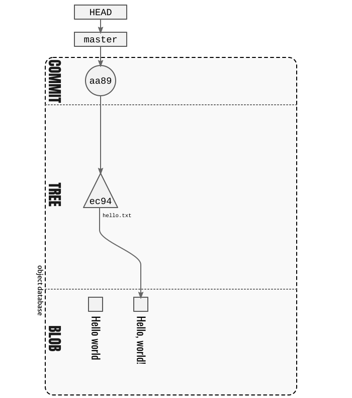
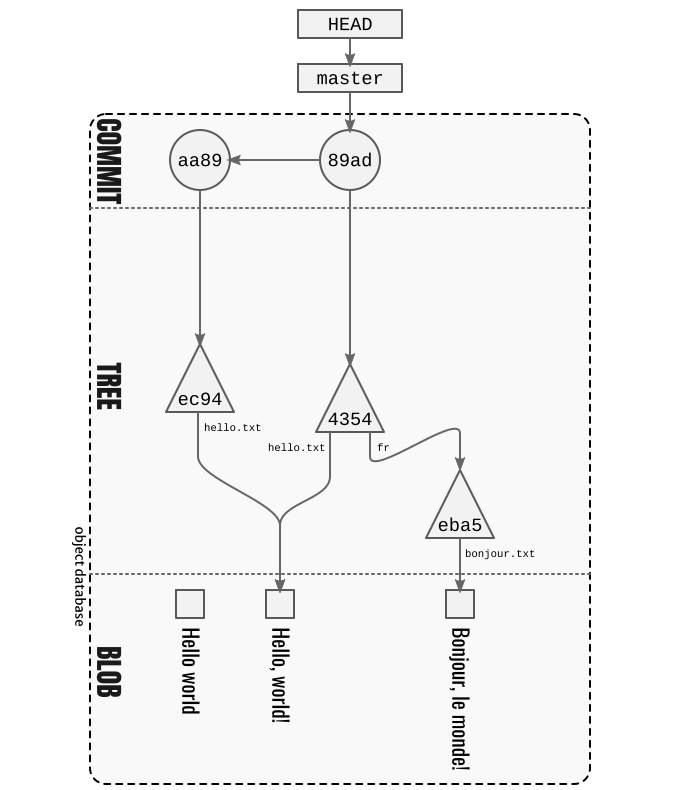
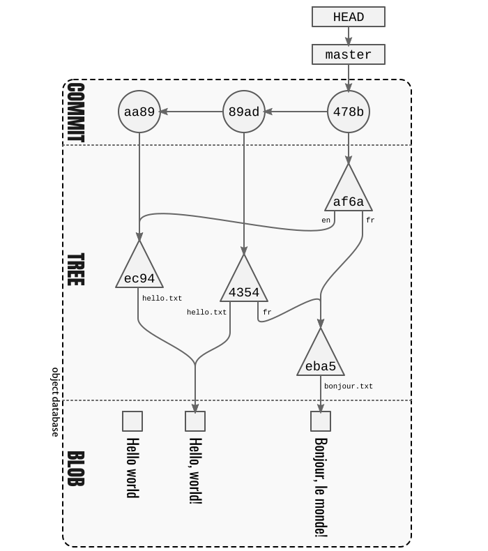

= About git commits
:author: Sylvain Leroux
:pin: -
:revnumber: v0.1
:revdate: 2022-05-28T17:19:46+02:00
:keywords: Git

[.teaser]
If you want to learn how to work with Git, this article is not for you.
But if you want to know how Git works, join me while I reveal some of its secrets.

== Introduction
We use Git every day.
But what does Git exactly do when we stage a file or commit a changeset to a repository?
How does Git store our data?
We will try to answer those questions by looking behind the scene to see how Git does its magic.

In this article, I assume you have a practical experience with Git, and you are familiar with the basic commands like `git add` and `git commit`.
I wrote this article on a Linux Ubuntu system. And I used a few commands that may not be available on your system, especially if you're coming from the Windows or Mac world.
But don't let that repel you: past the first few paragraphs, I'll use exclusively commands provided by Git so you can practice on virtually any device.

== Initial setup

Instead of a lecture-style course, we will learn by practice here.
For that, we will start by creating a new, clean repository that will serve as support for our experiments.

----
sh$ mkdir git-internal       # 1
sh$ cd git-internal          # 2
sh$ git init git-internal    # 3
Initialized empty Git repository in git-internal/.git/
sh$ cd git-internal/         # 4
sh$ find .git > list1        # 5
----

1. Let's create a new directory to work into.
2. And change the working directory to that one.
   For now, it's an ordinary directory. It has nothing special that would make it a Git repository.
   That will change at the next step.
3. Initialise the current directory as a Git repository.
   Git informs us it has created the hidden `.git` directory.
   It's Git's private space where it will store all the data it needs to work.
   Usually, you don't look into that directory, except maybe to change the configuration by editing `.git/config`.
   But today, we will be somewhat more curious than that.
4. We keep track of the files in the `.git` directory, so we have a basis of comparison to later check if new files were created.

=== Staging a data file

The Git command we use the most frequently is undoubtedly `git add`.
It puts a file in the so-called staging area so that it will be part of the next commit.

But that's the purpose of that command. In practice, what does it do in practice?

So let's create a new file.
We will stage this file in a moment, but for now, it is just basic file manipulation, and Git is absolutely not concerned by our work as `git status` will kindly remind you:

----
sh$ echo "Hello world"> hello.txt
sh$ ls
hello.txt  list1
sh$ git status
On branch master

No commits yet

Untracked files:
  (use "git add <file>..." to include in what will be committed)

        hello.txt
        list1

nothing added to commit but untracked files present (use "git add" to track)
----

Let's now track our newly created file, as suggested, using the `git add` command:

----
sh$ git add hello.txt
sh$ git status
On branch master

No commits yet

Changes to be committed:
  (use "git rm --cached <file>..." to unstage)

        new file:   hello.txt

Untracked files:
  (use "git add <file>..." to include in what will be committed)

        list1
----

At present, things have changed for Git: the file `hello.txt` is now staged and ready for a commit.
But we won't go that far immediately.
For the moment, we will focus on finding which files appeared in the `.git` directory as a consequence of the `git add` command:

----
sh$ find .git > list2
sh$ diff list1 list2
19a20
> .git/index
20a22,23
> .git/objects/80
> .git/objects/80/2992c4220de19a90767f3000a79a31b98d0df7
----

Ah, ah! Two new files have appeared:

* `.git/index`
* `.git/objects/80/2992c4220de19a90767f3000a79a31b98d0df7`

The `index` file is a binary file used by Git to keep track of the file staged for the next commit.
In fact, the `index` file is the stagging area.
It's a binary file, and it's difficult to examine using standard tools.
But Git provides some dedicated commands to interact with that file. We will keep that for later.

For now, let's concentrate on the second file:
the one with that strange name made of a series of digits and letters from `a' to `f`.
It sits in the `.git/objects` directory -- sometimes known as the Git's objects database.

Except for a few files (like the index), Git stores all its data in the object database.
For space efficiency, those files are compressed with Zlib, but that does not cause major problems that would prevent a closer inspection:

----
sh$ file .git/objects/80/2992c4220de19a90767f3000a79a31b98d0df7
.git/objects/80/2992c4220de19a90767f3000a79a31b98d0df7: zlib compressed data
----

So, let's look at the content of that file to see what interesting things it may contain.
For that, we need a raw zlib decompression tool. Here I use `zlib-flate` (part of the `qpdf` package on Ubuntu).
If that tool is not available for your system, I can suggest you try the `pigz` utility instead:

----
sh$ zlib-flate -uncompress < .git/objects/80/2992c4220de19a90767f3000a79a31b98d0df7
blob 12Hello world

# or

sh$ pigz -d < .git/objects/80/2992c4220de19a90767f3000a79a31b98d0df7
blob 12Hello world
----

Surprise! It's the content of the file `hello.txt` we have stagged!
Well almost.
Git added a header made of the word `blob` followed by the size in bytes of the data.
The `blob` part is actually the type of the file.
The `blob` type is the most common in the object database: it refers to a data file with no particular meaning for Git (a "user" data file).
All the files you add to a repository using `git add` end up being stored in `.git/objects` as a blob.
The objects database also contains other types of files used internally by Git, like the `tree` and `commit` objects.

[NOTE]
====
Not visible in the output of the `zlib-flate` command, there is also a https://en.wikipedia.org/wiki/Null_character[null character] that serves as a delimiter between the header and the data payload:
You can see it by piping the output of `zlib-flate` to the `cat -v` command:

----
sh$ zlib-flate -uncompress < .git/objects/80/2992c4220de19a90767f3000a79a31b98d0df7 | cat -v
blob 12^@Hello world
----

The `^@` is the https://en.wikipedia.org/wiki/Caret_notation[caret notation] for the null character.
====

But this is not the only surprise.
Do you remember the strange name of this file?
It looked like a random string, but if you tried the same experiment on your own computer, you might have noticed the file has the same name on your machine!

If fact, the name of the file is the SHA1 https://en.wikipedia.org/wiki/Hash_function[hash] of its content:

----
sh$ zlib-flate -uncompress < .git/objects/80/2992c4220de19a90767f3000a79a31b98d0df7 | sha1sum
802992c4220de19a90767f3000a79a31b98d0df7  -
----

[NOTE]
====
You may have noticed Git uses the first two digits of the hash as a subdirectory name and the rest of the digits as the actual file name.
But that's just an artifact used to overcome possible limitations of the underlying file system regarding the maximum number of files per directory.
====

In the Git vocabulary, that number, the SHA1 hash of the data, is called the file's Object Identifier (OID).
Since the OID is directly computed from the file's content, you may also sometimes read Git is a https://en.wikipedia.org/wiki/Content-addressable_storage[content adressable] filesystem.

Until now, I used external tools to reverse-engineer the blob file.
But, Git provides commands to deal with these data files without requiring any extra tool.
For example, to see the content of a Git object knowing its OID, you can use `git show`.
It returns the content of the file, with the Git-specific header removed:

----
sh$ git show 802992c4220de19a90767f3000a79a31b98d0df7
Hello world
----

You can also query the type, data length, and content of an object using the `git cat-file` command:

----
sh$ git cat-file -t 802992c4220de19a90767f3000a79a31b98d0df7
blob
sh$ git cat-file -s 802992c4220de19a90767f3000a79a31b98d0df7
12
sh$ git cat-file -p 802992c4220de19a90767f3000a79a31b98d0df7
Hello world
----

=== The index
It was a long time ago now, but you may still remember that we saw another file created after staging a file: `.git/index`.
Git stores the current staging information in that file.
The index is not part of the git object database, so you can't examine it using `git show` or `git cat-file`.
I need to introduce yet another command for that purpose: the `git ls-files` command.
Let's take a look at that:

----
sh$ git ls-files --stage
100644 802992c4220de19a90767f3000a79a31b98d0df7 0       hello.txt
----

Various pieces of information are returned by `git ls-files --stage` for each staged file:
* A set of permissions bits for the file.
* The OID referencing the content of the file.
* A "stage level". In normal use cases, you should always see 0 here.
* Finally, the name of the file.

In some sense, you may see the index file like a file system's directory data structure, whose entries point to the location of the data associated with each file name.

=== Updating a file in the index

Can we imagine now I don't want to commit my changes immediately because I noticed something was missing in `hello.txt`.
We may say, for example, that I forgot the punctuations. Let's fix that:

----
sh$ echo "Hello, world!"> hello.txt
sh$ git status
On branch master

No commits yet

Changes to be committed:
  (use "git rm --cached <file>..." to unstage)

        new file:   hello.txt

Changes not staged for commit:
  (use "git add <file>..." to update what will be committed)
  (use "git checkout -- <file>..." to discard changes in working directory)

        modified:   hello.txt

Untracked files:
  (use "git add <file>..." to include in what will be committed)

        list1
        list2
----

The interesting part here is we still have the version of `hello.txt` staged in the preceding section.
But we also have a different version of the file, having the same name, in the working tree.

You may already have encountered this situation in your daily Git work.
We usually fix that by simply adding the new version of the file into the index:

----
sh$ git add hello.txt
sh$ git status
On branch master

No commits yet

Changes to be committed:
  (use "git rm --cached <file>..." to unstage)

        new file:   hello.txt

Untracked files:
  (use "git add <file>..." to include in what will be committed)

        list1
        list2
----

Problem solved: the most recent version of `hello.txt` is now staged, ready for commit.
But did you ever wonder what happened to the previously staged version of the file?
Did the new version overwrite it? Is it definitively lost?

To answer these questions, let's see what exactly has changed as far as Git is concerned:

----
find .git > list3
sh$ diff list1 list3
19a20
> .git/index
20a22,25
> .git/objects/80
> .git/objects/80/2992c4220de19a90767f3000a79a31b98d0df7
> .git/objects/af
> .git/objects/af/5626b4a114abcb82d63db7c8082c3c4756e51b
----

Obviously, the previous version was not lost since the corresponding blob is still present in Git's object database.
But we may see Git has added a new object: the blob corresponding to the updated version of our file.

----
sh$ git cat-file -t af5626b4a114abcb82d63db7c8082c3c4756e51b
blob
sh$ git show af5626b4a114abcb82d63db7c8082c3c4756e51b
Hello, world!
----

Now both the new and the previous version of the file coexist in the database.
So, how does Git know which version it should commit?
By looking into the index.

But you don't have to take my words for granted:

----
sh$ git ls-files --stage
100644 af5626b4a114abcb82d63db7c8082c3c4756e51b 0       hello.txt
----

Indeed, the index entry for the `hello.txt` file has changed and now references the object `af5626b4a114abcb82d63db7c8082c3c4756e51b`.

The key point to remember here is the previous version of a file is not lost when you stage a new version of a file.
Instead, Git creates a new blob in the object database, and the index is updated to point to the latest version of the file.

A similar thing would happen when we remove a file with `git rm`: the index is updated.
But the blog corresponding to the removed file still exists in the object database.

=== What about the commits?

OK, we have staged files. We found they were stored as blob objects in Git's object database.
We also learned the index is updated to reference the staged object through their OID.
But what happens when we commit our changes?

----
sh$ git commit -m "Initial commit"
[master (root-commit) aa89f17] Initial commit
 1 file changed, 1 insertion(+)
 create mode 100644 hello.txt
----

As a quick note, you remember the permissions bits we saw when using `git ls-files`.
We can see them in the output produced by `git commit`.

----
find .git > list4
sh$ diff list1 list4
5a6
> .git/refs/heads/master
19a21
> .git/index
20a23,28
> .git/objects/80
> .git/objects/80/2992c4220de19a90767f3000a79a31b98d0df7
> .git/objects/af
> .git/objects/af/5626b4a114abcb82d63db7c8082c3c4756e51b
> .git/objects/aa
> .git/objects/aa/89f1701dc5409bb63228f1e9f64aa7ff0bba17
22a31,32
> .git/objects/ec
> .git/objects/ec/947e3dd7a7752d078f1ed0cfde7457b21fef58
23a34,39
> .git/COMMIT_EDITMSG
> .git/logs
> .git/logs/HEAD
> .git/logs/refs
> .git/logs/refs/heads
> .git/logs/refs/heads/master
----
This time, many things have changed!

First, we have not one but two new entries in the object database! This calls for a closer examination:

----
sh$ git cat-file -t ec947e3dd7a7752d078f1ed0cfde7457b21fef58
tree
sh$ git cat-file -p ec947e3dd7a7752d078f1ed0cfde7457b21fef58
100644 blob af5626b4a114abcb82d63db7c8082c3c4756e51b    hello.txt
----

Interesting! We now have a new type of object in our database: a `tree`.
And that tree is nothing more than a copy of the index at the time of the commit.
Speaking of commit, let's examine the other new object created in the database:

----
sh$ git cat-file -t aa89f1701dc5409bb63228f1e9f64aa7ff0bba17
commit
sh$ git cat-file -p aa89f1701dc5409bb63228f1e9f64aa7ff0bba17
tree ec947e3dd7a7752d078f1ed0cfde7457b21fef58
author Sylvain Leroux <sylvain@chicoree.fr> 1653860652 +0200
committer Sylvain Leroux <sylvain@chicoree.fr> 1653860652 +0200

Initial commit

----

Yes: it's the `commit` object. And now the picture is complete:

The commit object stores the commit message, some metadata, and a pointer to a tree object.
The tree object records the name of the files in the staging area at the moment of the commit, each file entry pointing to a blob object.
The blob store the actual content of the file.

That's several levels of indirection, but computers are notably good at following references, and references of references, ad-lib, without getting lost.

By the way, speaking of the index, what's its content after the commit?

----
sh$ git ls-files --stage
100644 af5626b4a114abcb82d63db7c8082c3c4756e51b 0       hello.txt
----

It hasn't changed! One thing to remember is a Git commit is a complete snapshot of the staging area and not just a record of the changes that occurred since the previous commit (as other revision control systems might do).
Even if you never touch the `hello.txt` file again, it will still remain, in its present form, accessible from all subsequent commits.

But since Git index the data files ("blob") by the hash of their content, it will not duplicate the data that hasn't changed between commits.

=== Branches

Our commit was also the first commit of the repository.
As a consequence, another file was also added in the `.git/refi/heads` directory after our commit.
This directory is the place where Git stores the branches. And on my version of Git, the default branch is named `master`.
So here it is:

----
sh$ cat .git/refs/heads/master
aa89f1701dc5409bb63228f1e9f64aa7ff0bba17
----

Yes, a branch is nothing more than a pointer to a commit in the object database.

=== The HEAD

If you read about Git, you might have heard of the HEAD.
It's just a reference maintained by Git to know which commit your current working tree is based on.
And indeed, there's nothing more here:

----
sh$ cat .git/HEAD
ref: refs/heads/master
----

By the way, instead of examining the content of Git's internal files, you may use the `git rev-parse` command to find the commit corresponding to the HEAD or a branch.
Branches may be identified either by their short name or with the `refs/heads` part included:

----
sh$ git rev-parse HEAD
aa89f1701dc5409bb63228f1e9f64aa7ff0bba17

sh$ git rev-parse master
aa89f1701dc5409bb63228f1e9f64aa7ff0bba17

sh$ git rev-parse refs/heads/master
aa89f1701dc5409bb63228f1e9f64aa7ff0bba17
----

== The case of the subdirectories

Until now, we simply added files sitting at the root of the working directory.
But how does Git handle sub-directories?

To examine that, we will create a new directory and add a file inside that directory.
Then we will use `git add` to stage that newly added file.

----
sh$ mkdir fr
sh$ echo "Bonjour, le monde!" > fr/bonjour.txt
sh$ git add fr/bonjour.txt
----

We used the `git add` command.
So, the new file is staged -- in other words, Git has created a new blob object to store the file's content, and the index was updated.
Let's look at the index first this time:

----
sh$ git ls-files --stage
100644 84745588cb61f0d9e15a41144af8daf30caf20d4 0       fr/bonjour.txt
100644 af5626b4a114abcb82d63db7c8082c3c4756e51b 0       hello.txt
----

You may notice `git ls-files` does not present files in subdirectory differently than files sitting at the working tree's root.
Simply, the file is displayed with its name prefixed by the path to the file.
The https://git.kernel.org/pub/scm/git/git.git/tree/Documentation/technical/index-format.txt?id=HEAD[internal file format of the index] is somewhat more complex, but `git ls-files` hides that complexity and present us a flat list of files.

By looking at the index, we also can see the OID of the blob containing our new data.
I let the command name blank in the code block below as you should now be able to use the correct Git command to examine that object:

----
sh$ git  ....  84745588cb61f0d9e15a41144af8daf30caf20d4
Bonjour, le monde!
----

For memory, the HEAD still references the commit we made in the first part of this article:

----
sh$ git rev-parse HEAD
aa89f1701dc5409bb63228f1e9f64aa7ff0bba17

sh$ git cat-file -p aa89f1701dc5409bb63228f1e9f64aa7ff0bba17
tree ec947e3dd7a7752d078f1ed0cfde7457b21fef58
author Sylvain Leroux <sylvain@chicoree.fr> 1653860652 +0200
committer Sylvain Leroux <sylvain@chicoree.fr> 1653860652 +0200

Initial commit
----

But we have some changes staged. No need to further delay our next commit:

----
sh$ git commit -m "Second commit"
[master 89adbd7] Second commit
 1 file changed, 1 insertion(+)
 create mode 100644 fr/bonjour.txt

sh$ git log --format=oneline
89adbd7ea23b4394d34d2bf26a83d6721d3f9e94 (HEAD -> master) Second commit
aa89f1701dc5409bb63228f1e9f64aa7ff0bba17 Initial commit
----

The `git log` command gives us a lot of information:
First, the HEAD still references the `master` branch

----
sh$ cat .git/HEAD
ref: refs/heads/master
----

Then, the branch master now references the commit `89adbd7ea23b4394d34d2bf26a83d6721d3f9e94`

----
sh$ git cat-file -p 89adbd7ea23b4394d34d2bf26a83d6721d3f9e94
tree 43541e6608e3172081f67d469a133e1262b723c6
parent aa89f1701dc5409bb63228f1e9f64aa7ff0bba17
author Sylvain Leroux <sylvain@chicoree.fr> 1653943012 +0200
committer Sylvain Leroux <sylvain@chicoree.fr> 1653943012 +0200

Second commit
----

You may notice this commit record one more piece of information compared to the initial one:
there is now a `parent` field that references the previous commit.
Using that field, Git remembers in which order the commits are chained.

We may also see by examining the commit object that a new tree object was created with OID `43541e6608e3172081f67d469a133e1262b723c6`.
You probably have an idea of what we will do now:

----
sh$ git cat-file -p 43541e6608e3172081f67d469a133e1262b723c6
040000 tree eba5b0c78c7a3f9cdfcf13ca10121527312003b5    fr
100644 blob af5626b4a114abcb82d63db7c8082c3c4756e51b    hello.txt
----

This time again, things are slightly different compared to our first commit.
You can see the tree object now contains two entries.
One for the file `hello.txt` we already had and whose content is stored as a blob object.
But there is now another entry pointing toward another tree object.

Here Git truly behaves like a filesystem and adopts a hierarchical tree structure.
The tree `fr` whose OID is `eba5b0c78c7a3f9cdfcf13ca10121527312003b5` being like a sub-directory of the repository.
As previously, you should now be familiar enough with that operation to complete the code block below with the correct command to examine the content of the new tree.

----
sh$ git  ........ ..  eba5b0c78c7a3f9cdfcf13ca10121527312003b5
100644 blob 84745588cb61f0d9e15a41144af8daf30caf20d4    bonjour.txt
----

== Moving things

I could multiply the examples, and, as a matter of fact, I encourage you to continue this little game of reverse engineering on Git by yourself.
On my side, I will conclude with a final example, this time to show you what happens when you move files around in your repository:

----
sh$ mkdir en
sh$ cp hello.txt en/
sh$ git rm hello.txt
rm 'hello.txt'
sh$ git add en/hello.txt
sh$ git commit
Aborting commit due to empty commit message.
sh$ git commit -m "Third commit"
[master 478b7ac] Third commit
 1 file changed, 0 insertions(+), 0 deletions(-)
 rename hello.txt => en/hello.txt (100%)
----

This time I moved the `hello.txt` file into its own subdirectory.
I took the slow path, using first a file copy, then `git add` and finally `git rm`, whereas `git mv` would have done the trick.
However, I made that choice on purpose here to see if (and how) Git can keep track by itself of file movements in the repository.

Alas! Despite my efforts, if you observe the output of the `git commit` command, you can see Git was not fooled. It correctly understood we still had the same file but at a different location.

[NOTE]
====
Git, like the standard *nix command `mv`, does not make a distinction between a "move" and a "rename" operation.
====

Take a few minutes' break here to imagine what clue has allowed Git to reach that conclusion.

To solve that mystery, we will apply the same procedure as above:
examine the commit object, then the tree(s), to finally descend to the blobs:

----
sh$ git log --format=oneline
478b7aceb5bf619290dc7dfac4118bef494023a1 (HEAD -> master) Third commit
89adbd7ea23b4394d34d2bf26a83d6721d3f9e94 Second commit
aa89f1701dc5409bb63228f1e9f64aa7ff0bba17 Initial commit

sh$ git cat-file -p 478b7aceb5bf619290dc7dfac4118bef494023a1
tree af6aba37e10abbcfc78d57d8777118d4cfa8620b
parent 89adbd7ea23b4394d34d2bf26a83d6721d3f9e94
author Sylvain Leroux <sylvain@chicoree.fr> 1653944421 +0200
committer Sylvain Leroux <sylvain@chicoree.fr> 1653944421 +0200

Third commit

sh$ git cat-file -p af6aba37e10abbcfc78d57d8777118d4cfa8620b
040000 tree ec947e3dd7a7752d078f1ed0cfde7457b21fef58    en
040000 tree eba5b0c78c7a3f9cdfcf13ca10121527312003b5    fr
----

We still have the `fr` entry refrencing the tree object `eba5b0c78c7a3f9cdfcf13ca10121527312003b5` (which is the same as in the previous commit).
But we now have another tree for the second subdirectory we created this time.

And guess what? If you examine the content of that tree object, you will see it references the exact same blob as before:

----
sh$ git cat-file -p ec947e3dd7a7752d078f1ed0cfde7457b21fef58
100644 blob af5626b4a114abcb82d63db7c8082c3c4756e51b    hello.txt
----

Since Git implements a content-addressable filesystem, as long as the content of the file `hello.txt` does not change, it still has the same OID.
You can move it anywhere into your repository, you can even rename it, its OID will not change.
So it's relatively easy for Git to detect that in a previous commit, the blob OID `af5626b4a114abcb82d63db7c8082c3c4756e51b` was referenced from a different tree, and so conclude the file has moved.

Even better than that!
It's not obvious by looking only at the tree dump produced by `git cat-files`, but it's more visible in the above drawing:
the content addressable strategy used by Git made it able to reuse the tree `ec947e3dd7a7752d078f1ed0cfde7457b21fef58` created with our initial commit.
After all, what we now call the `en/` subdirectory was nothing more than the root of the working tree when we did our first commit. So, Git can detect tree movements with the same ease as a file move/rename operation.

== Conclusion
And this ends our tour of the Git's backstage. You may continue your exploration by examining the object database of one of your repositories.
Probably the database will contain many, many more objects than the example I showed you today.
But, starting from a commit or the index, you should be able to find your way down to the content of any file in the repository.
And doing so, you would mostly do by hand the same job as the `git checkout` command.

Since we have seen a lot of new Git commands, I left you with a quick recap.
As always, I hope you liked this article, and I'm looking forward to reading you on Twitter!

`git add`::Store in the object database a blog corresponding to the added file, and update the index to reference that blob.
`git cat-file`::Given its OID, display the content or metadata of an object.
`git commit`::Capture a snapshot of the index by creating a commit and eventually one or several tree(s) in the object database.
`git log`::Display information about a commit and its ancestors by following the parent reference of each commit.
`git ls-files`::Show information about files in the index (or in the working tree).
`git rev-parse`::Show the OID of a commit. Useful notably to deference the HEAD or a branch name.
`git rm`::Remove the reference to a file from the index. Do not remove any object from the database.
`git show`::Given its OID, display the content of an object. Support more formatting options than `git cat-file`.
