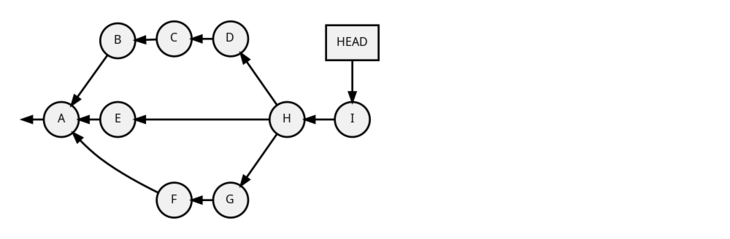
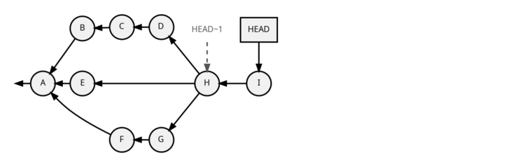
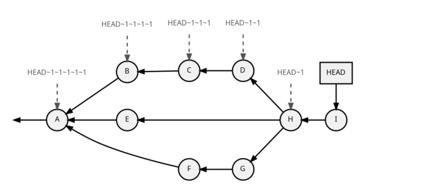
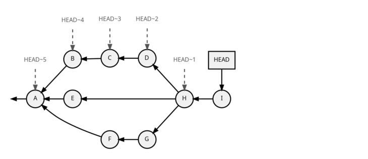
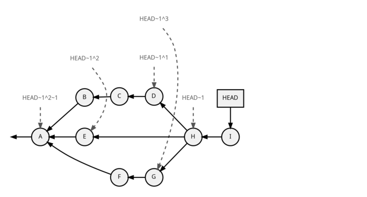

= Some useful git references syntax
:author: Sylvain Leroux
:pin: -
:revnumber: 1.0
:revdate: 2022-05-17T15:15:08+02:00
:keywords: NodeJS, IPC

[.teaser]
You already know you can address a git commit by a branch name or its SSH1.
But you also know an everyday use case is to compare a revision with its parent or grand-parent.
So how to do that without copying human-unfriendly SHA1s all over the place?

== My sample git repository

To illustrate that article, I created the sample git repository shown below:

[NOTE]
====
The letters in the circles are the commit subjects (the first line of the commit message).
For simplicity, when I said "the commit I" in this article, it should be understood as "the commit whose subject is I".

By the way, I also use the word `revision` as a synonym for the noun `commit`, as explained in the https://git-scm.com/docs/gitglossary#def_revision[Git glossary].
====

If you prefer ASCII-art, this is how `git log --graph` would display that same graph:

----
git log --graph --format='%H %s %d'
* 5e3d4d6f1597c72c072bb338b67f132fa39cf590 I  (HEAD -> top)
*-.   6ab53365cd582dfb1b718cfafb24a20aeffa9659 H 
|\ \  
| | * 5bc5e54cbcea28ece75220212afd27a72b01c791 G 
| | * 3142719efea5332de447d70e05358f21bfcae64c F 
| * | cbd3b84a3f12365fd5200458b7d12d8a32481168 E 
| |/  
* | d247342566d3c7d2431b65371c098b40c0b0b38c D 
* | 29f2a862b56efce5a1b7fa91353b59d4551b6242 C 
* | 2b6a6c88c445c4a40a04d7ee83edec7b1f4310d9 B 
|/  
* 4e1edf56f536589fb5b8f712e61e47bad56f8999 A 

----

As you can see, we have a moderately complex history, with an octopus merge in revision H.
You may also see the HEAD currently references the commit I.
Now the question is simple: how can I compare the current working tree with the content of a previous revision?

== Manual work using `git log`

The most obvious solution to address a commit is by its SHA1.
The `git log` command has an option to retrieve that.
Using the `--format` option, you may also somewhat automate your work.
Let's imagine I want to compare my current code with the one that is part of the commit whose subject is `C`:

----
sh$ git log --format='%h %s' | awk '$2~/C/ { print $1 }'
29f2a86
----

Here I used a custom log format, easy to parse with `awk`.
The value displayed on the screen is an unambiguous prefix of the SHA1 corresponding to commit C. 

Finally, I can issue my `git diff` command:
----
sh$ git diff 29f2a86
...
----

This solution works, but definitely, it's not the most user-friendly.
So in the remaining of this article, we will see alternate syntaxes to reference a commit's ancestor.

== Ancestry references

The first ancestry reference notation we will study is the tilde (`~`).
If you add `~` or `~1` (both are synonyms) after a reference, you reference its parent.

For example:

----
sh$ git rev-parse HEAD
5e3d4d6f1597c72c072bb338b67f132fa39cf590
sh$ git rev-parse HEAD^1
6ab53365cd582dfb1b718cfafb24a20aeffa9659
----

Or graphically:

From commit I to H, there was no ambiguity.
But which is the "previous commit" of H?
Since this is a three-branch merge, which path will follow Git to find the parent of revision H?
Actually, Git remembers in which order the branches were merged.
You can check that using the `git show` command:

----
sh$ git show HEAD~1
commit 6ab53365cd582dfb1b718cfafb24a20aeffa9659
Merge: d247342 cbd3b84 5bc5e54
Author: Sylvain Leroux <sylvain@chicoree.fr>
Date:   Fri May 20 10:03:41 2022 +0200

    H

----
The merge occurred from a working tree whose HEAD pointed to commit d247342, and the user issued a command equivalent to `git merge cbd3b84 5bc5e54`.

When you use the `~1` notation, Git will always follow the first branch.
Of course, you can add as much tilde as you want, as this is illustrated below:

----
sh$ git log --no-walk --format="%h %s %d" HEAD HEAD~1 HEAD~1~1
5e3d4d6 I  (HEAD -> top)   # HEAD         ^^^^
6ab5336 H                  # HEAD's parent     ^^^^^^
d247342 D                  # Head's parent's parent   ^^^^^^^^
----

You can shorten that notation by replacing n consecutive occurrences of `~1` with `~n`.
So `HEAD\~1~1~1` could be written as `HEAD~3` instead:

So if I want to compare the code in my working tree with the one from revision A, I can write:

----
git diff HEAD~5
----

We can address any revision on the ancestor's path build following the first-branch rule using the tilde.
But what if I want to compare my code with the one found in a revision from another branch?
Say revision E or G, for example?
Well, Git offers us the caret for that.

== Branch selector

Previously, we saw Git remembers the order of the branches in a merge.
If you want to select the branch to follow, you may express that with a caret (`^`).
The tilde always follows the path of the first branch. So `~1` is synonymous with `^1`.
On the other hand, `^2` will follow the path of the second branch, `^3` the third, and so on.

Let's check that from the command line:

----
sh$ git log --no-walk --format="%s %h <-%p" HEAD~1
H 6ab5336 <-d247342 cbd3b84 5bc5e54

sh$ git log --no-walk --format="%s %h" HEAD~1^1 HEAD~1^2 HEAD~1^3
G 5bc5e54
D d247342
E cbd3b84
----

As an exercise, I let you try to find how you could reference the various revisions of our commit graph when the HEAD point to revision I.

[caption=]
.Path to ancestors when HEAD points to revision I
[cols="2*<",options="header"]
|===
|Target
|Path from I

|Revision I
|`HEAD`

|Revision H
|`HEAD~1`

|Revision G
|`HEAD~1^3`

|Revision F
|

|Revision E
|`HEAD~1^2`

|Revision D
|`HEAD~~` or `HEAD\~1~1` or `HEAD~2` or `HEAD~1^1` or `HEAD~^` or `HEAD^^`

|Revision C
|

|Revision B
|

|Revision A
|`HEAD\~1^2~1` or `HEAD~5` or ...
|===

== And that's not all

Git supports several other ways to reference a revision.
Do you remember the very first example on top of this article? We used `awk` to parse Git's log to access a revision matching a commit message.
Believe it or not, Git can do that natively, without resorting to an external tool as we did:

----
sh$ git log --no-walk --pretty=oneline :/E
cbd3b84a3f12365fd5200458b7d12d8a32481168 E
----

A colon, followed by a slash, means you want to address the most recent revision matching the specified regular expression.
But what if several revisions match the given regular expression?

----
sh$ git log --no-walk --pretty=oneline ':/(D|E|G)'
5bc5e54cbcea28ece75220212afd27a72b01c791 G
----

The regular expression in the above command would match the commit message of the revisions D, E, and G.
But Git chose the most recent one, commit G in this example.

For a complete description of all the ways of addressing a Git revision, I refer you to the official documentation:

* https://git-scm.com/docs/revisions

If you read that document, you will discover you can also write something like `git diff '@{3 days ago}'` (yes, yes: it's perfectly valid and does exactly what you imagine!)
But that will be for another time.
I hope you enjoyed this article.
If this is the case, don't forget to follow me on https://twitter.com/Yes_I_Know_IT[Twitter]!

