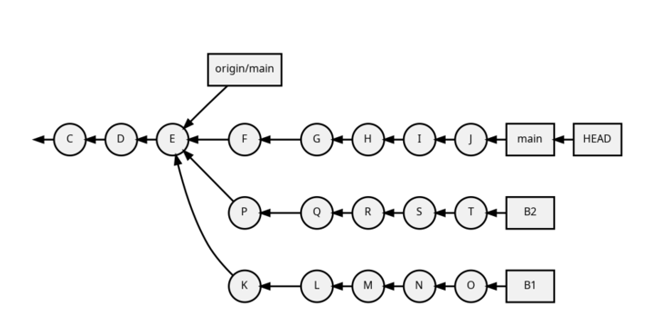
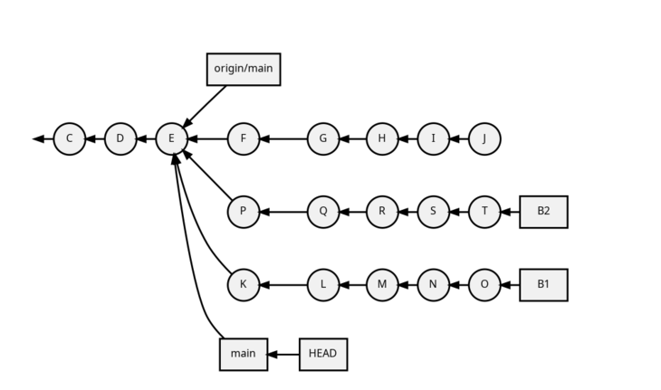
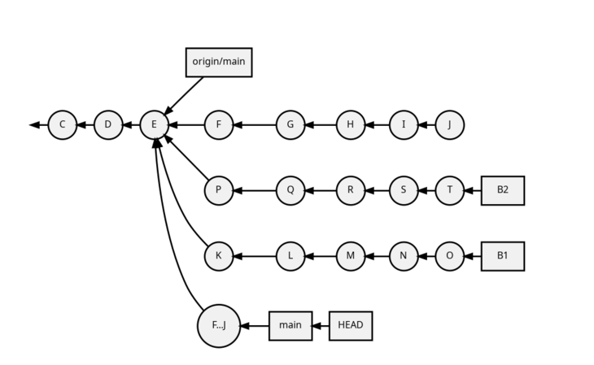
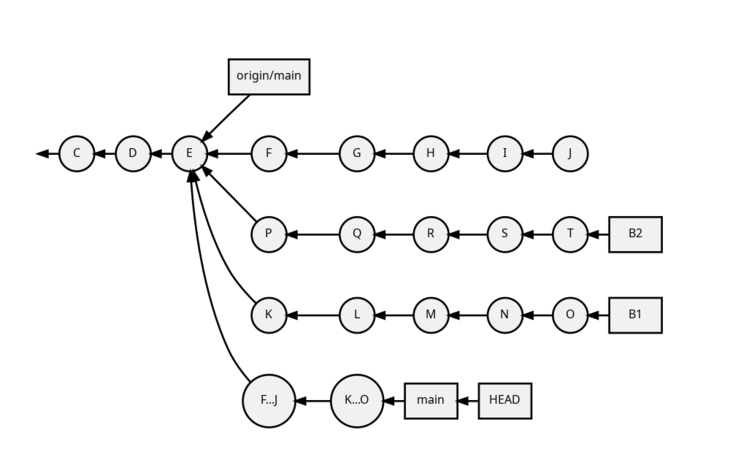
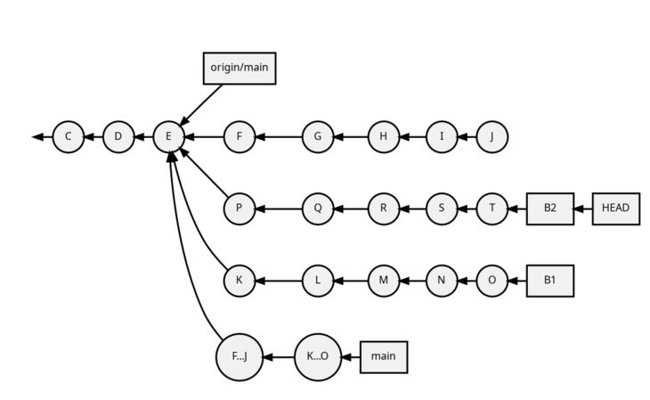
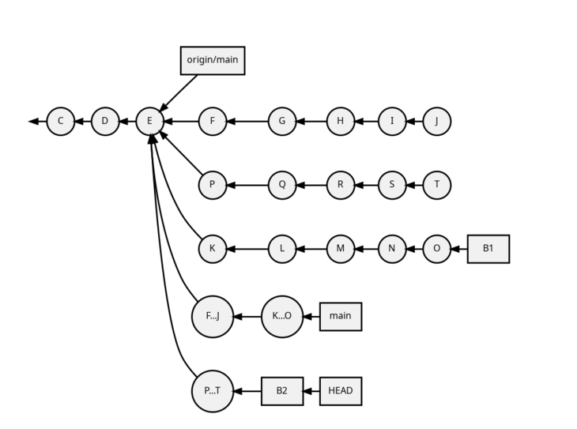
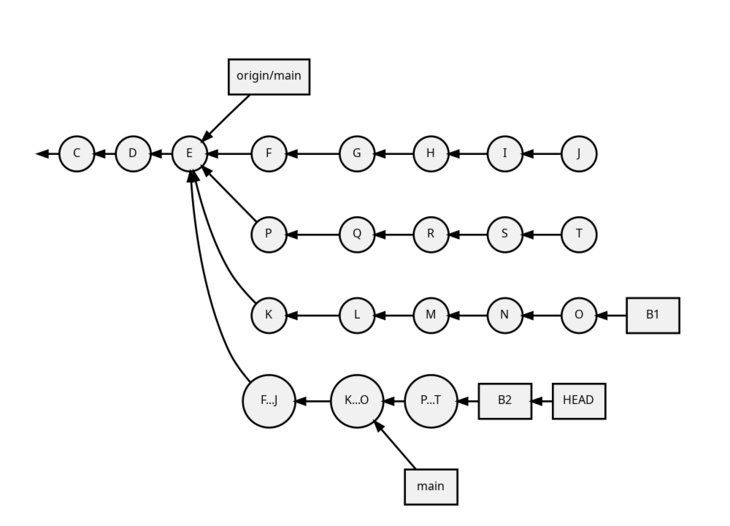
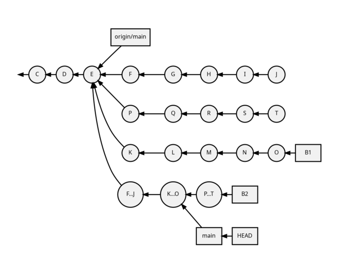
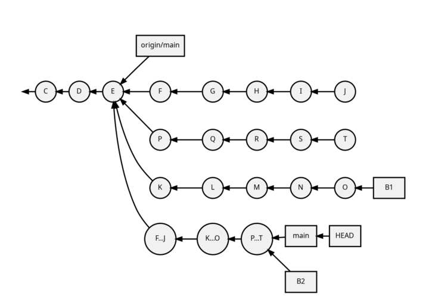

= How to combine multiple Git commits?
:author: Sylvain Leroux
:pin: -
:revnumber: 0.1
:revdate: 2022-05-11T18:53:03+02:00
:keywords: Git

[.teaser]
As ancient wisdom says: "Commit often, push once."
If you follow that advice, you will have many small commits you would prefer to combine before pushing your work.
In this article, we will see three different techniques to do that. 

== My starting point

Let's consider the repository whose commits are represented below:



As you can see, I carried out some work on three different branches after the commit labeled E.
We may imagine this commit is the upstream head "origin/main," and I fixed three different issues starting from there.
I worked on the three separate branches in parallel.
And I took great care to ensure the changes introduced in each branch would not conflict with each other.

I have now finished my work, and I want to push the three fixes upstream.
But before that, I would like to group the commits of each branch into only one commit.
To do that, you have at least three solutions:

1. `git reset --soft`
2. `git merge --squash`
3. `git rebase -i`

== Resetting the HEAD

Our first solution will group the revisions F to J of the main branch. This solution is based on the `git reset --soft` command.

The `git reset` command allows pointing the HEAD of the current repository to another commit.
But what's the HEAD?

=== The HEAD

The https://git-scm.com/docs/gitglossary#def_HEAD[HEAD] is a reference maintained by Git, which designs the "current" branch.
The graph above shows that the HEAD is a symbolic link to the main branch, and the main branch points to the commit J.
It is a typical situation when you check a branch out with Git.
If you have a Git repository at hand, you can verify that by yourself using the `git symbolic-ref` and `git rev-parse` commands:

```
git symbolic-ref HEAD
refs/heads/main

git rev-parse HEAD
ba0546758fae4d3ca0250d9a2e817fff79f73443
git rev-parse main
ba0546758fae4d3ca0250d9a2e817fff79f73443
```
The two `git rev-parse` commands above should display the same result: the SHA1 of your latest commit.

=== Manipulating the HEAD

After that digression, let's use the `git reset` command to directly manipulate the HEAD.
In the command below, I will move the HEAD (remember, it's a symbolic link to the "main" branch) back to the commit designated by origin/main.
I could do that by specifying the SHA1 of that commit, using the branch name "origin/main", or using a relative revision identifier.
That's what I will do here, rewinding the HEAD by five commits:

```
git reset --soft HEAD~5
```

=== Introducing a new revisions

Here is the situation now:



Two remarks:

* First, even if we no longer have any branch pointing to the revisions J, Git didn't remove it. It is still accessible (notably, in that case, through the ORIG_HEAD reference).
* Second, because of the `--soft` option, `git reset` did not change the https://git-scm.com/docs/gitglossary#def_working_tree[working tree] (the checked-out files) nor the https://git-scm.com/docs/gitglossary#def_index[index] (the list of files to include in the next commit)

The second point is essential here: it means the files on your working tree still contain all the changes introduced by the revisions F to J.
And those files are already staged for the next commit (no need for `git add`).
But the HEAD (and the main branch) point to an older commit.
We are in the same situation as if you have made all the changes in one single step directly from revision E.
Since the changes are already staged, all we need is to `git commit` them:

```
git commit -m "F...J"
```

And here is the new revision graph:



[NOTE]
====
We introduced a new revision here totally independent of the F through J revisions.
It just appends the new revision contains the same changes.
The metainformation (commit message, author, date) introduced by revisions F and its descendants was not propagated in the new revision.
It's up to you to provide a detailed commit message so that important information is not lost in the process. 
====

== Squash merge

Let's now consider the changes introduced in the B1 branch.
This time, we will use `git merge --squash` to compact the revisions K to O into one single commit, applied on top of the HEAD:

```
# from the branch main
git merge --squash B1
``` 

Despite its name, `git merge` does not create a merge when used with the `--squash` option.
Instead, it applies to the index and the working tree all the revisions introduced by the distant branch since the common ancestor revision.

Just like in the previous section, the last step is to commit the changes:

```
git commit -m "K...O"
``` 

That leads to the following revision graph:



== Rebasing

Our last option to combine multiple commits into one will use the `git rebase` command.
While learning Git, I found it was the most obvious solution.
But I don't really know why: while preparing this article, I realized it was also the most cumbersome way of doing it.
Of course, your mileage may vary.
However, even if you share that feeling, take some time to read the following few paragraphs: it introduces rebasing techniques you may find helpful in other circumstances.

Here I want to combine the commits P to T.
The starting point is to check out the branch B2:

```
git checkout B2
```



=== Interactive rebasing to squash commits

Git offers the `git rebase -i` command when you want to rewrite the history of a local branch.
The `-i` option stands for interactive.
Indeed, it will open an EDITOR so you can reorder, remove and/or combine the revisions introduced in the previous commits of the working branch.
Here I'm interested in rewriting the last five commits:

```
git rebase -i HEAD~5
```

XXX SCREENSHOT HERE

In the editor, replace the word "pick" with "squash" on lines two and the followings.
As the help message explains, this will meld each marked revision with its parent.
You probably want to update the commit message too.
So I suggest you also replace "pick" with "reword" on the first line.
Once you've saved your modifications, quit the text editor, and Git will start applying the change you requested.
If you have asked to update the commit message, Git will present another EDITOR so you can type it.

The revision graph should now look like that:



Like in the two others solutions explained in this article, we introduced a new commit, combining the changes of several other revisions.
Notice how the B2 and HEAD references have changed to point to the newly introduced commit.

=== Rebasing to reapply changes on a new base tip

At this point, it would be tempting to immediately check out the main branch and merge it with B2.
But as a postulate, at the start of this article, I stated the three initial sets of changes when independent.
So I can apply them sequentially.
In other words, I don't really need a merge here: it is enough to apply the `P...T` changes on top of the existing main branch.

Unfortunately, the main branch has changed a lot since the initial development of the P to T revisions.
To take that into account, we will issue another `git rebase` command.
This time a non-interactive one:

```
git rebase main
```

This command asks Git to change the attaching point of the current branch to the most recent version of the main branch.
And indeed:





=== Fast-forwarding

Now, back to the main branch:

```
git checkout main
```



And finally, we can advance the HEAD and the main references to point to the `P...T` revision:

```
git merge --ff-only B2
```

I said above I didn't want to introduce a merge (i.e., a commit with several parents).
And despite that, I use the `git merge` command!?!
Well, if it can `git merge` will perform a *fast-forward* operation instead of a merge.
In that case, Git applies the new revisions sequentially on top of the current HEAD.
Git will do that automatically by default.
So, strictly speaking, no option is required here.
However, I still used the `--ff-only` flag to avoid `git merge` falling back to another merge strategy if it can't fast forward.
It is a safety net, so `git merge` will fail if it can't fast-forward.
Letting me the work of fixing the issue--instead of introducing a merge commit I didn't want.

Here, because my different branches of development were independent, the process went smoothly, resulting in that final graph:



And here we are: starting from three independent branches developed in parallel with many small commits, we end up with three broader-scoped commits applied sequentially on our main branch, ready to push upstream. 

== Are these "best practices"?

It is always a good idea to have a different branch for each issue you are working on.
Notably, the author worked directly in the main branch in the example I used here, something I wouldn't recommend.
But that's how it was done in the real-world repository that inspired this post--and that's probably the use case many new (and not so new) Git users will encounter.
I also focussed exclusively on Git while writing this article.
In particular, I didn't talk about testing or CI.
Of course, you should run all your test suites (or push your changes on the CI platform) at each step.
I also recommend rebasing (and re-testing) the individual branches after each change in the main branch--a technique I introduced in the preceding section.

== Conclusion

Of course, you won't need to mix the three different solutions presented here in your daily work.
You will probably stick to the one that better suits your workflow.
Incidentally, I wasn't exhaustive on the topic.
For example, you may also use `git stash` to combine several commits in a single one.
I will let you investigate that alternative by yourself.
As always, don't hesitate to share your findings on social networks!
